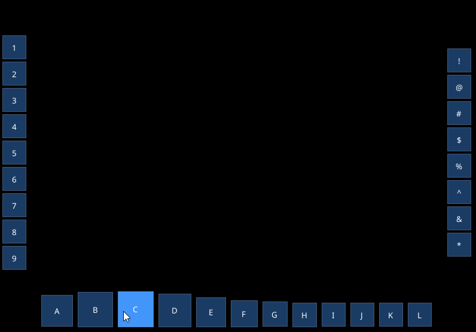

# ImCoolBar

This repository is a fork of the original [aiekick/ImCoolBar](https://github.com/aiekick/ImCoolBar).
It keeps the original API spirit while fixing hover glitches and adding optional smoothing and antialiasing controls.

---

## What’s new in this fork

**Bug fixes**

* Removed the initial Y‑axis “jump” on first hover/unhover.

  * Correct cross‑axis thickness: `normal + (hovered - normal) * anim_scale`.
  * `anim_scale` is updated **before** positioning the window.
  * Predicted thickness used for positioning each frame.
  * First item size is initialized from `normal_size` (not 0).
  * `anchor` is clamped to `[0..1]`.

**Smoothing (time‑based EMA)**

* Mouse coordinate filtering with half‑life in milliseconds; frame‑rate invariant.
* `anim_scale` smoothing to targets 0/1 with its own half‑life; fallback to the old step‑based `anim_step` when disabled.

**Antialiasing (optional)**

* Local AA for this bar’s draw list (`AntiAliasedFill|Lines`) can be enabled via config.
* Optional local `FrameRounding` override for smoother visuals.
* Draw‑list flags and style are restored in `EndCoolBar()`.

**Pixel snapping (optional)**

* Separate snapping controls for window position and inner item offsets to avoid visible “stepping”.

**Metrics**

* Extra debug outputs: `MouseEmaHalfLifeMs`, `MouseEmaAlpha`, `AnimEmaHalfLifeMs`, `AnimEmaAlpha`, current `AnimScale`, per‑item sizes.

**(If applicable) Minor API refactor**

* `ImCoolBarConfig` and flags may live in the global namespace to mirror Dear ImGui style (functions remain in `ImGui::`). See **Migration** below.

**Result:**

<p align="center">
  
</p>

---

## Branches & versioning

* **Stable branch:** `stable` — recommended for users.
* **Development:** `main` (or `dev`) — may contain work‑in‑progress changes.
* **Releases:** tagged as `vX.Y.Z`.

---

## Compatibility / docking support

Works with Dear ImGui **1.92** on both docking and non‑docking branches.
Docking window flags are enabled automatically when `IMGUI_HAS_DOCK` is defined, or by defining `IMCOOLBAR_HAS_DOCKING` before including `ImCoolBar.h`.

```cpp
// Define before including the header if you want to force docking host flags
#define IMCOOLBAR_HAS_DOCKING
#include "ImCoolBar.h"
```

---

## Minimal sample

```cpp
// Helper button that sizes itself to the current item width/scale
auto coolbar_button = [](const char* label) -> bool {
    float w = ImGui::GetCoolBarItemWidth();
    return ImGui::Button(label, ImVec2(w, w));
};

ImCoolBarConfig cfg;                     // defaults
cfg.anchor = ImVec2(0.5f, 1.0f);         // bottom-center of the viewport
cfg.mouse_ema_half_life_ms = 120.0f;     // time-based mouse smoothing (0 = off)
cfg.anim_ema_half_life_ms  = 120.0f;     // time-based anim smoothing (0 = step mode)
cfg.enable_local_aa        = true;       // local AA just for this bar
cfg.rounding_override      = 6.0f;       // optional per-bar rounding
cfg.pixel_snap_window      = true;       // snap window to whole pixels (for crisp text)
cfg.pixel_snap_items       = false;      // allow subpixel item offsets

if (ImGui::BeginCoolBar("##CoolBarMain", ImCoolBarFlags_Horizontal, cfg)) {
    const char* labels = "ABCDEFGHIJKL";
    for (const char* p = labels; *p; ++p)
        if (ImGui::CoolBarItem())
            (void)coolbar_button(std::string(1, *p).c_str());
    ImGui::EndCoolBar();
}
```

**Result:**


---

## Horizontal & vertical bars in one frame

```cpp
// Shared smoothing/visuals
ImCoolBarConfig common;
common.mouse_ema_half_life_ms = 100.0f;
common.anim_ema_half_life_ms  = 120.0f;
common.enable_local_aa        = true;
common.rounding_override      = 6.0f;

// Bottom horizontal bar
{
    auto cfg = common; cfg.anchor = ImVec2(0.5f, 1.0f);
    if (ImGui::BeginCoolBar("##CoolBarBottom", ImCoolBarFlags_Horizontal, cfg)) {
        for (char c = 'A'; c <= 'H'; ++c)
            if (ImGui::CoolBarItem()) ImGui::Button(std::string(1, c).c_str(), ImVec2(ImGui::GetCoolBarItemWidth(), ImGui::GetCoolBarItemWidth()));
        ImGui::EndCoolBar();
    }
}

// Left vertical bar
{
    auto cfg = common; cfg.anchor = ImVec2(0.0f, 0.5f);
    if (ImGui::BeginCoolBar("##CoolBarLeft", ImCoolBarFlags_Vertical, cfg)) {
        for (char c = '1'; c <= '6'; ++c)
            if (ImGui::CoolBarItem()) ImGui::Button(std::string(1, c).c_str(), ImVec2(ImGui::GetCoolBarItemWidth(), ImGui::GetCoolBarItemWidth()));
        ImGui::EndCoolBar();
    }
}
```

---

## API Reference (public)

```cpp
// Begin a coolbar window. Returns true while building items.
IMGUI_API bool BeginCoolBar(const char* label,
                            ImCoolBarFlags flags = ImCoolBarFlags_Vertical,
                            const ImCoolBarConfig& cfg = {},
                            ImGuiWindowFlags wflags = ImGuiWindowFlags_None);
IMGUI_API void  EndCoolBar();

// Per-item call. Place your widget when this returns true.
IMGUI_API bool  CoolBarItem();

// Helpers for sizing; valid only inside an active coolbar item.
IMGUI_API float GetCoolBarItemWidth();
IMGUI_API float GetCoolBarItemScale();

// Debug/metrics window
IMGUI_API void  ShowCoolBarMetrics(bool* opened);
```

---

## Configuration Reference

| Field                    | Type     |   Default | Description                                                          |
| ------------------------ | -------- | --------: | -------------------------------------------------------------------- |
| `anchor`                 | `ImVec2` | `{-1,-1}` | Normalized anchor in the viewport; e.g. `{0.5,1.0}` = bottom center. |
| `normal_size`            | `float`  |    `40.0` | Base size for items.                                                 |
| `hovered_size`           | `float`  |    `60.0` | Max size when fully hovered.                                         |
| `anim_step`              | `float`  |    `0.15` | Legacy step per frame for `anim_scale` (used when EMA disabled).     |
| `effect_strength`        | `float`  |     `0.5` | Strength parameter for hover influence curve.                        |
| `mouse_ema_half_life_ms` | `float`  |     `0.0` | EMA half‑life for mouse filtering; `<=0` disables.                   |
| `anim_ema_half_life_ms`  | `float`  |     `0.0` | EMA half‑life for `anim_scale`; `<=0` uses `anim_step`.              |
| `enable_local_aa`        | `bool`   |   `false` | Enable AA on this bar’s draw list only.                              |
| `rounding_override`      | `float`  |    `-1.0` | `<0` keep global; `>=0` push per‑bar `FrameRounding`.                |
| `pixel_snap_window`      | `bool`   |    `true` | Snap window position to whole pixels (crisp text).                   |
| `pixel_snap_items`       | `bool`   |   `false` | Snap inner item offsets; turn **off** for subpixel smoothness.       |

**Notes**

* EMA alpha per frame: `α = 1 - exp(-ln(2) * dt_ms / half_life_ms)`.
* Subpixel movement is visually smoother with AA and non‑zero rounding.

---

## Migration (if you use the original API)

Depending on your fork state:

* If `ImCoolBarConfig` moved to the **global** namespace, update usages:

  * `ImGui::ImCoolBarConfig{...}` → `ImCoolBarConfig{...}`
  * Flags remain `ImCoolBarFlags_*`.
* If you added an overload taking `ImVec2 anchor`, you may call:

  ```cpp
  ImGui::BeginCoolBar("##CoolBarMain", ImCoolBarFlags_Horizontal, ImVec2(0.5f, 1.0f));
  ```

  Otherwise, construct `ImCoolBarConfig` explicitly.

---

## Demo app


---

## Building / integration

* This widget is a tiny pair of `.h/.cpp` files; just add them to your build with Dear ImGui.
* For docking:

  * Use Dear ImGui’s docking branch **or** define `IMCOOLBAR_HAS_DOCKING` yourself.
* Backends: any Dear ImGui backend; for best visual smoothness you may enable MSAA on your renderer.

---

## License

MIT. See the original license header in the source files.

If you distribute this fork, keep the original MIT license text and copyright notice.
You may add your own copyright line for your changes (e.g. `© 2025 YourName`).

---

## Credits

* Original work by **Stephane Cuillerdier (Aiekick)** — [aiekick/ImCoolBar](https://github.com/aiekick/ImCoolBar).
* Improvements and maintenance in this fork by the community.

